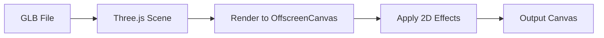

# Grainrad Complete Refactoring Plan

## Executive Summary

This document outlines a comprehensive refactoring plan for the Grainrad ASCII/Effects converter application. The goal is to implement all features described in the specification and fix existing issues.

---

## Current State Analysis

### What's Working
- Basic ASCII art conversion
- Matrix Rain effect (partial)
- Dithering (Bayer only)
- Halftone effects
- Basic pixelate/mosaic effects
- Image/video/webcam input
- Basic export (PNG, JPG, text, SVG)

### Critical Issues Identified

#### 1. Type System Conflicts
- [`src/types/effects.ts`](src/types/effects.ts) defines `EffectType` with 17 effects
- [`src/hooks/useWebGPURenderer.ts`](src/hooks/useWebGPURenderer.ts:3) defines a different `EffectType` with only 6 values
- [`src/components/EffectsPanel.tsx`](src/components/EffectsPanel.tsx:23) defines yet another `EffectSettings` interface

#### 2. Missing Core Features
- **Pixel Sorting**: Not implemented
- **VHS/Analog Glitch**: Not implemented
- **3D Model Support**: Not implemented
- **Video Recording**: Falls back to PNG
- **GIF Export**: Falls back to PNG
- **Floyd-Steinberg Dithering**: Only Bayer matrix implemented

#### 3. Incomplete Effect Parameters
- ASCII background opacity missing
- Matrix Rain glow not fully exposed
- CMYK halftone separation missing
- Film grain separate from digital noise

#### 4. Architecture Issues
- WebGPU hook exists but Canvas uses Canvas2D
- No shader system architecture
- EffectsPanel has isolated state management

---

## Refactoring Phases

### Phase 1: Core Architecture Refactoring

#### 1.1 Consolidate Type Definitions
Create a single source of truth in [`src/types/effects.ts`](src/types/effects.ts):

```typescript
// Unified EffectType - all effects from specification
export type EffectType =
  // ASCII & Text
  | 'ascii'
  | 'dithering'
  // Pixel Effects
  | 'pixel-sorting'
  | 'pixelate'
  | 'mosaic'
  // Matrix
  | 'matrix-rain'
  | 'matrix-dots'
  // Halftone
  | 'halftone'
  | 'halftone-cmyk'
  // VHS/Analog
  | 'vhs-glitch'
  | 'scanlines'
  // Edge Detection
  | 'edge-detection'
  | 'edge-lines'
  // Other
  | 'threshold'
  | 'invert'
  | 'led'
  | 'grain'
  | 'noise';

// Complete settings interface
export interface EffectSettings {
  // Character settings
  characterSet: 'standard' | 'extended' | 'blocks' | 'custom';
  customCharacters: string;
  
  // Grid/Resolution
  cellSize: number;
  spacing: number;
  
  // Adjustments
  brightness: number;
  contrast: number;
  threshold: number;
  
  // Color
  colored: boolean;
  bgColor: string;
  fgColor: string;
  backgroundOpacity: number; // NEW
  
  // Effect-specific
  // Pixel Sorting
  sortDirection: 'horizontal' | 'vertical';
  sortComparator: 'luma' | 'hue' | 'saturation';
  sortThreshold: number;
  
  // VHS Glitch
  trackingNoise: number;
  colorBleed: number;
  warpIntensity: number;
  jitterAmount: number;
  
  // Matrix Rain
  speed: number;
  trailLength: number;
  glow: number;
  randomization: number;
  
  // Halftone
  dotSize: number;
  dotAngle: number;
  cmykSeparation: boolean;
  
  // Dithering
  ditherAlgorithm: 'bayer' | 'floyd-steinberg';
  colorPalette: '1bit' | 'gameboy' | 'custom';
  
  // Grain/Noise
  grainIntensity: number;
  noiseIntensity: number;
  
  // Post-processing
  scanlines: boolean;
  scanlineIntensity: number;
  blur: number;
  
  // Export
  format: 'png' | 'jpg' | 'gif' | 'mp4' | 'webm' | 'svg' | 'text';
  quality: number;
}
```

#### 1.2 WebGPU Rendering Pipeline

Create a proper WebGPU-based rendering system:

```
src/renderer/
  WebGPUContext.ts       # WebGPU initialization and state
  ShaderManager.ts       # Load and compile WGSL shaders
  TextureManager.ts      # Handle texture uploads
  RenderPipeline.ts      # Main render loop
  effects/
    ASCIIEffect.ts       # ASCII shader implementation
    PixelSortEffect.ts   # Pixel sorting compute shader
    VHSGlitchEffect.ts   # VHS effect shaders
    ...
```

#### 1.3 Shader Architecture

Each effect will have:
- WGSL shader file
- Parameter binding layout
- Render pass configuration

Example shader structure:
```wgsl
// ascii.wgsl
struct Uniforms {
  cellSize: f32,
  brightness: f32,
  contrast: f32,
  threshold: f32,
  colored: u32,
  fgColor: vec4<f32>,
  bgColor: vec4<f32>,
  backgroundOpacity: f32,
}

@group(0) @binding(0) var<uniform> uniforms: Uniforms;
@group(0) @binding(1) var inputTexture: texture_2d<f32>;
@group(0) @binding(2) var outputTexture: texture_storage_2d<rgba8unorm, write>;

@compute @workgroup_size(16, 16)
fn main(@builtin(global_invocation_id) global_id: vec3<u32>) {
  // ASCII conversion logic
}
```

---

### Phase 2: Missing Effects Implementation

#### 2.1 Pixel Sorting Effect

```typescript
interface PixelSortSettings {
  threshold: number;      // Brightness threshold for sorting
  direction: 'horizontal' | 'vertical';
  comparator: 'luma' | 'hue' | 'saturation';
  sortAngle: number;      // For diagonal sorting
}
```

Implementation approach:
1. Extract pixel rows/columns based on direction
2. Apply threshold mask to determine sort regions
3. Sort pixels within masked regions
4. Write back to texture

#### 2.2 VHS & Analog Glitch

```typescript
interface VHSGlitchSettings {
  trackingNoise: number;    // Horizontal static lines
  trackingSpeed: number;    // Roll speed
  colorBleed: number;       // Chromatic aberration
  warpIntensity: number;    // Geometric distortion
  jitterAmount: number;     // Random position offset
  scanlineIntensity: number;
}
```

Shader effects needed:
- Horizontal noise bands with vertical scrolling
- RGB channel separation
- Sine-wave geometric warp
- Random horizontal offset per scanline

#### 2.3 Film Grain & Digital Noise

```typescript
interface GrainNoiseSettings {
  grainIntensity: number;   // Film grain strength
  grainSize: number;        // Grain particle size
  noiseIntensity: number;   // Digital noise strength
  noiseColor: boolean;      // Colored noise vs monochrome
}
```

#### 2.4 Floyd-Steinberg Dithering

Implement error diffusion dithering:
```typescript
function floydSteinbergDither(
  pixels: Uint8ClampedArray,
  width: number,
  height: number,
  palette: Color[]
): Uint8ClampedArray {
  // Error diffusion matrix:
  //       *  7/16
  // 3/16 5/16 1/16
}
```

#### 2.5 CMYK Halftone Separation

```typescript
interface CMYKHalftoneSettings {
  cyanAngle: number;
  magentaAngle: number;
  yellowAngle: number;
  blackAngle: number;
  dotSize: number;
}
```

---

### Phase 3: 3D Model Support

#### 3.1 Dependencies
```bash
npm install three @types/three
```

#### 3.2 GLB Loader Component

```typescript
// src/components/ModelViewer.tsx
import { GLTFLoader } from 'three/examples/jsm/loaders/GLTFLoader';

interface ModelViewerProps {
  modelUrl: string;
  onRender: (canvas: HTMLCanvasElement) => void;
}
```

#### 3.3 Integration Flow



---

### Phase 4: Export System Overhaul

#### 4.1 Video Recording

```typescript
// src/utils/VideoExporter.ts
class VideoExporter {
  private mediaRecorder: MediaRecorder;
  
  startRecording(canvas: HTMLCanvasElement): void;
  stopRecording(): Promise<Blob>;
  getSupportedFormats(): string[];
}
```

Supported formats:
- WebM (VP9 codec)
- MP4 (if browser supports H.264)

#### 4.2 GIF Export

```typescript
// src/utils/GifExporter.ts
import GIF from 'gif.js';

async function exportGif(
  frames: ImageData[],
  width: number,
  height: number,
  delay: number
): Promise<Blob>
```

#### 4.3 Recording Controls

Add to UI:
- Record button (start/stop)
- Duration timer
- Format selection (GIF/WebM/MP4)

---

### Phase 5: UI/UX Improvements

#### 5.1 Effect-Specific Controls

Each effect should expose its relevant parameters:

| Effect | Controls |
|--------|----------|
| ASCII | Cell Size, Character Set, Color Mode, Background Opacity |
| Pixel Sort | Threshold, Direction, Comparator |
| VHS Glitch | Tracking, Color Bleed, Warp, Jitter |
| Matrix Rain | Speed, Trail Length, Glow, Color |
| Halftone | Dot Size, Angle, CMYK Mode |
| Dithering | Algorithm, Palette |

#### 5.2 Presets Implementation

```typescript
export const PRESETS: Preset[] = [
  {
    id: 'terminal',
    name: 'Terminal',
    effect: 'ascii',
    settings: {
      characterSet: 'standard',
      cellSize: 6,
      colored: false,
      fgColor: '#00ff00',
      bgColor: '#000000',
      backgroundOpacity: 1,
    },
  },
  {
    id: 'newsprint',
    name: 'Newsprint',
    effect: 'halftone',
    settings: {
      cellSize: 4,
      colored: false,
      dotSize: 4,
      dotAngle: 45,
    },
  },
  {
    id: 'broken-tape',
    name: 'Broken Tape',
    effect: 'vhs-glitch',
    settings: {
      trackingNoise: 0.5,
      colorBleed: 0.3,
      warpIntensity: 0.2,
      scanlines: true,
    },
  },
  {
    id: 'cyber',
    name: 'Cyber',
    effect: 'pixel-sorting',
    settings: {
      threshold: 0.6,
      direction: 'vertical',
      comparator: 'hue',
      colored: true,
    },
  },
];
```

#### 5.3 UI Layout Improvements

```
+------------------+------------------------+------------------+
|    LeftSidebar   |       Canvas           |   RightSidebar   |
|                  |                        |                  |
| [Input]          |                        | [Effect Name]    |
| - File drop      |    +------------+      | [Preview Mode]   |
| - Webcam         |    |            |      | [Effect Params]  |
|                  |    |   Render   |      | [Color]          |
| [Effects Tree]   |    |            |      | [Post-Process]   |
| - ASCII          |    +------------+      | [Export]         |
| - Pixel Sort     |                        |                  |
| - VHS Glitch     | [Zoom] [FPS] [Record]  |                  |
| - Halftone       |                        |                  |
| - ...            |                        |                  |
|                  |                        |                  |
| [Presets]        |                        |                  |
+------------------+------------------------+------------------+
```

---

### Phase 6: Testing & Optimization

#### 6.1 Performance Targets
- 60fps for 1080p video processing
- <100ms effect switching time
- <500ms initial load time

#### 6.2 Optimization Strategies
1. **GPU Compute Shaders**: Move pixel sorting to compute shaders
2. **Texture Atlasing**: Batch character textures for ASCII
3. **Frame Skipping**: Adaptive quality for slow devices
4. **Web Workers**: Offload CPU-intensive operations

#### 6.3 Browser Compatibility
| Feature | Chrome | Firefox | Safari | Edge |
|---------|--------|---------|--------|------|
| WebGPU | 113+ | - | 17+ | 113+ |
| WebGL 2 | 56+ | 51+ | 15+ | 79+ |
| MediaRecorder | 47+ | 51+ | 14.1+ | 79+ |

Fallback strategy: Use WebGL 2 when WebGPU unavailable

---

## Implementation Order

1. **Week 1**: Phase 1 - Core Architecture
   - Consolidate types
   - Set up WebGPU context
   - Create shader manager

2. **Week 2**: Phase 2 - Missing Effects
   - Pixel Sorting
   - VHS Glitch
   - Grain/Noise improvements

3. **Week 3**: Phase 3 & 4 - 3D Support & Export
   - GLB loading
   - Video recording
   - GIF export

4. **Week 4**: Phase 5 & 6 - UI & Testing
   - Effect controls
   - Presets
   - Performance optimization

---

## File Structure After Refactoring

```
src/
  types/
    effects.ts           # Unified type definitions
    presets.ts           # Preset configurations
    
  renderer/
    WebGPUContext.ts     # WebGPU initialization
    WebGLContext.ts      # WebGL fallback
    ShaderManager.ts     # Shader loading/compilation
    RenderPipeline.ts    # Main render loop
    effects/
      ASCIIEffect.ts
      PixelSortEffect.ts
      VHSGlitchEffect.ts
      HalftoneEffect.ts
      DitherEffect.ts
      MatrixRainEffect.ts
      GrainNoiseEffect.ts
      
  loaders/
    ImageLoader.ts
    VideoLoader.ts
    ModelLoader.ts       # GLB loading
    
  exporters/
    ImageExporter.ts
    VideoExporter.ts
    GifExporter.ts
    
  components/
    Editor.tsx           # Main editor (refactored)
    Canvas.tsx           # Canvas with WebGPU
    LeftSidebar.tsx      # Input/Effects panel
    RightSidebar.tsx     # Settings panel
    TopBar.tsx           # Toolbar
    BottomBar.tsx        # Status bar
    ModelViewer.tsx      # 3D model viewer
    RecordingControls.tsx
    
  hooks/
    useRenderer.ts       # Unified renderer hook
    useMediaInput.ts     # Media loading hook
    useEffectSettings.ts # Settings management
    
  utils/
    colorConversion.ts
    pixelSorting.ts
    dithering.ts
    
  shaders/
    ascii.wgsl
    pixel_sort.wgsl
    vhs_glitch.wgsl
    halftone.wgsl
    dither.wgsl
    matrix_rain.wgsl
```

---

## Questions for Clarification

Before proceeding with implementation, I need to confirm:

1. **WebGPU vs WebGL Priority**: Should WebGPU be the primary renderer with WebGL fallback, or should we prioritize broader compatibility with WebGL 2?

2. **3D Model Support Scope**: For GLB models, do you want:
   - Just static rendering with effects applied?
   - Full 3D interaction (rotate, zoom, pan)?
   - Animation support for rigged models?

3. **Export Format Priority**: Which export formats are most important?
   - Video (WebM/MP4)?
   - GIF animation?
   - SVG vector output?

4. **Existing Code Disposal**: Should I:
   - Refactor existing files in place?
   - Create new structure and migrate gradually?

---

## Next Steps

Once the plan is approved, I will switch to Code mode to begin implementation starting with Phase 1: Core Architecture Refactoring.